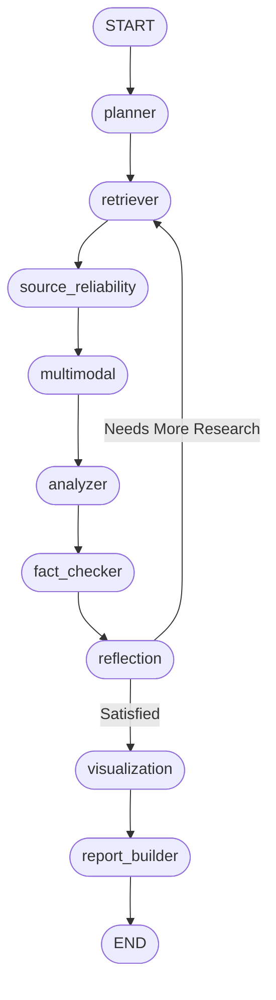

# Python Multi-Agent Deep Researcher POC

This is a structured POC demonstrating a multi-agent deep research workflow using LangGraph, LangChain, Streamlit, and the OpenRouter API. It utilizes an advanced, multi-step pipeline with dynamic loops for iterative reflection.

## Project Structure

```text
deep_researcher/
├── app.py                      # Main Streamlit UI
├── requirements.txt            # Python dependencies
├── agents/                     # Specialized agent implementations
│   ├── planner_agent.py
│   ├── retriever_agent.py
│   ├── source_reliability_agent.py
│   ├── multimodal_agent.py
│   ├── analyzer_agent.py
│   ├── fact_checker_agent.py
│   ├── reflection_agent.py
│   ├── visualization_agent.py
│   └── report_builder_agent.py
├── graph/                      # LangGraph definition and state
│   ├── graph.py
│   └── state.py
└── utils/                      # Utilities
    └── llm_utils.py
```

## Architecture

The workflow is orchestrated using LangGraph:



*(Note: The Streamlit app also dynamically renders this diagram in the sidebar using `workflow.get_graph().draw_mermaid_png()` if dependencies support it.)*

## Technical Details (Step-by-Step)

The workflow executes through specialized agents handling precise aspects of research:

1. **Planner Agent**
   - Devises a succinct research plan based on the user's initial topic.

2. **Retriever Agent**
   - Intelligently decides which search tools to invoke based on the topic and the plan.
   - Retrieves information from a variety of sources in parallel using `concurrent.futures`.
   - **Sources include:**
     - **Local RAG**: Queries the FAISS index for relevant uploaded document context.
     - **Arxiv**: Searches scientific papers using the `arxiv` wrapper.
     - **Wikipedia**: Searches for encyclopedic context.
     - **DuckDuckGo**: Free dynamic web searching tool.
     - **Tavily / SerpAPI**: Performs web searches if API keys are provided.

3. **Source Reliability Agent**
   - Assigns reliability scores to the retrieved sources to filter out untrusted constraints.

4. **Multimodal Agent**
   - A placeholder stage intended for retrieving and processing images, charts, and video data.

5. **Analyzer Agent**
   - Synthesizes trends and extracts raw analysis from the trusted sources.

6. **Fact Checker Agent (RAG)**
   - Validates the intermediate analysis against the original source docs to ensure accuracy.

7. **Reflection Agent**
   - Acts as an internal critic. Evaluates if the research lacks crucial areas or has contradictory conclusions.
   - **Looping Mechanism:** If gaps are found, it triggers the loop back to the Retriever Agent (with updated context) to get more targeted info.

8. **Visualization Agent**
   - Determines the best types of charts/metrics to display to the user based on the finalized research data.

9. **Report Builder Agent (with Streaming)**
   - Drafts the final multi-section markdown research report integrating fact-checked text, visualizations, and concrete citations.
   - Outputs the response in a streaming type-writer fashion using callbacks.

## Requirements
- Python 3.11+
- An [OpenRouter API Key](https://openrouter.ai/)
- Optional: API keys for advanced search providers (e.g. Tavily, SerpAPI)

## Setup & Run

1. Navigate to this directory in your terminal:
   ```bash
   cd deep_researcher
   ```

2. Create a virtual environment (optional but recommended):
   ```bash
   python -m venv venv
   source venv/bin/activate  # On Windows use: venv\Scripts\activate
   ```

3. Install the dependencies:
   ```bash
   pip install -r requirements.txt
   ```

4. Run the Streamlit application:
   ```bash
   streamlit run app.py
   ```

Enjoy your deep research workflow!
