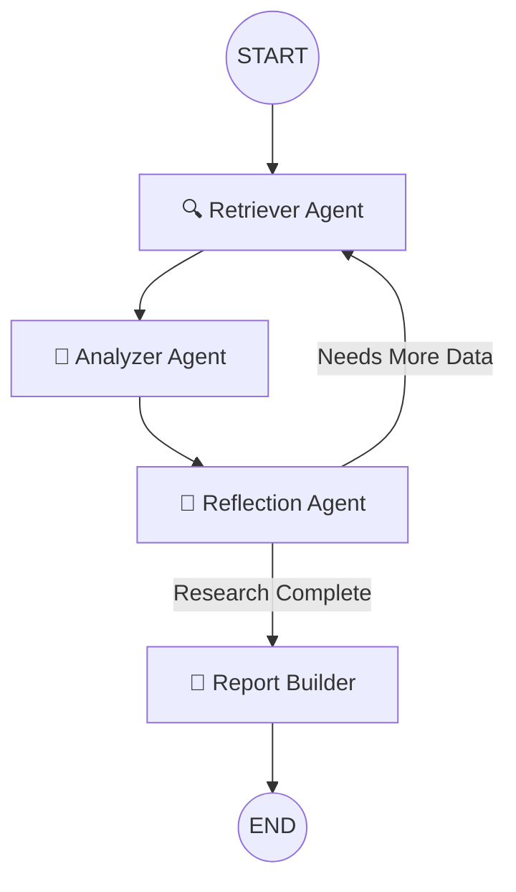

# 🔬 Multi-Agent Researcher

An elite, multi-agent AI framework for comprehensive, multi-source research investigations. Built on LangGraph with a Model Council for multi-perspective synthesis, granular pipeline cost tracking, and a premium Streamlit UI. Submitted for the Engineering Accelerator hackathon.

[](https://www.python.org/downloads/)
[](https://streamlit.io/)
[](LICENSE)

---

## 🌟 What It Does

Type a research question or upload documents. Four specialized agents collaborate to produce a structured, highly analytical report with:

- **Dynamic Parallel Retrieval**: Automatically selects the best tools (Tavily, ArXiv, Wikipedia, DuckDuckGo) and fetches data concurrently.
- **Local RAG (FAISS)**: Upload PDFs or TXT files directly in the UI via the "📎 Attach Documents" button. They are instantly indexed and searched.
- **The Model Council**: The Analyzer agent consults multiple distinct LLMs (e.g., GPT-4o-mini and Claude 3 Haiku via OpenRouter) to gain diverse perspectives, synthesizing them into profound insights.
- **Self-Correction via Reflection**: The system automatically detects coverage gaps or contradictions in the research and loops back to find missing information.
- **Pipeline Cost Dashboard**: A dedicated analytics dashboard provides a **nested Stage → Model breakdown** of every query, showing exactly how much each agent stage (Retriever, Analyzer, Reflection, Report Builder) spent on each model.
- **Contextual Follow-up Chat**: After a report is generated, you can ask follow-up questions in a chat interface that strictly uses the retrieved evidence as context. Each follow-up is also tracked in the dashboard.
- **Dynamic Model Selection**: Switch between AI providers (OpenAI, Anthropic, Google Gemini) directly from the sidebar dropdown — all routed seamlessly through OpenRouter with a single API key.

## 🏗️ Architecture



## 🎬 Recommended Demo Query

> *"Is nuclear energy net-positive for global climate goals when accounting for waste, costs, and accidents?"*

This query reliably exercises the full pipeline:
1. Retriever fires across 4 tools in parallel
2. Analyzer's Model Council surfaces consensus + unique perspectives
3. Reflection identifies contradictions (climate benefit vs. waste/safety)
4. *Loop fires* — Retriever runs again with the gap as new query
5. Final report shows insights from both rounds with contradictions flagged

Backup queries (if the first one's API hits rate limits):
- "How do GLP-1 drugs reshape food and beverage company strategy?"
- "Can open-source LLMs replace enterprise SaaS copilots for sensitive workloads?"

### The Four Agents (Mapped to Hackathon PDF Requirements)

| PDF Requirement | Our Agent | What it does |
|---|---|---|
| *Contextual Retriever Agent* | `retriever_agent` | Dynamic tool routing across Tavily, ArXiv, Wikipedia, DuckDuckGo, and local FAISS — runs in parallel via ThreadPoolExecutor |
| *Critical Analysis* + *Insight Generation* | `analyzer_agent` | Embeds findings into FAISS for grounding, runs Model Council (GPT-4o-mini + Claude Haiku), synthesizes cross-model consensus into insights |
| *Report Builder Agent* | `report_builder_agent` | Compiles structured markdown report with citations, contradictions section |
| Extra agent (per PDF: "any more agents you want to add") | `reflection_agent` | Identifies coverage gaps and contradictions; drives the conditional loop back to Retriever |

*Note:* The `analyzer_agent` deliberately combines two PDF roles — Critical Analysis (RAG-grounded evidence assessment) and Insight Generation (Model Council synthesis) — because the Council pattern is most powerful when both responsibilities feed the same multi-model reasoning step.

## 💻 Tech Stack

- **Orchestration**: LangGraph (conditional routing + persistent memory)
- **LLM Gateway**: OpenRouter (one key, all providers — GPT, Claude, Gemini)
- **RAG**: FAISS + HuggingFace (`all-MiniLM-L6-v2`)
- **Retrieval**: Tavily, ArXiv, Wikipedia, DuckDuckGo
- **State & Memory**: LangGraph SqliteSaver checkpointer (`checkpoints.db`)
- **Telemetry**: Custom SQLite Database (`stats.db`) — per-stage, per-model token & cost tracking
- **UI**: Streamlit with Custom CSS (Glassmorphism & glowing agent widgets)

## 🚀 Quick Start

### Prerequisites

- Python 3.10+
- `uv` package manager (recommended)
- API keys (both have free tiers):
  - **OpenRouter** — https://openrouter.ai/keys
  - **Tavily** — https://tavily.com

### Setup

```bash
# Clone and enter the repo
git clone https://github.com/madakasirak/hackathon_Outskill.git
cd hackathon_Outskill

# Copy the env template and fill in your keys
cp .env.example .env
# Edit .env with your real OPENROUTER_API_KEY and TAVILY_API_KEY

# Set up the virtual environment and install dependencies using uv
uv venv
source .venv/bin/activate
uv sync

# Launch the Streamlit app
streamlit run app.py
```

The app opens at `http://localhost:8501`.

## 📁 Folder Structure

```
deep-researcher/
├── README.md                            # You are here
├── pyproject.toml                       # Project metadata
├── requirements.txt                     # Pinned runtime dependencies
├── .env.example                         # Template for required env vars
├── .gitignore                           # Standard ignores
├── app.py                               # Premium Streamlit UI & Entry Point
│
├── agents/                              # The 4 Core LangGraph Agents
│   ├── retriever_agent.py               # Parallel retrieval + FAISS
│   ├── analyzer_agent.py                # Model Council logic
│   ├── reflection_agent.py              # Gap detection loop
│   └── report_agent.py                  # Final markdown assembly
│
├── graph/                               # LangGraph Orchestration
│   ├── state.py                         # TypedDict for agent memory
│   └── workflow.py                      # Node and Edge assembly
│
├── services/                            # Utilities & Integrations
│   ├── callbacks.py                     # Token tracking (stage→model nested breakdown)
│   ├── db.py                            # SQLite stats database
│   ├── llm.py                           # Dynamic LLM factory (OpenRouter gateway)
│   └── rag.py                           # Shared HuggingFace embeddings service
│
└── tools/                               # Custom Tools
    ├── utilities.py                     # PDF parsing and REPL
    └── __init__.py
```

## 📊 The Dashboard

This project includes a dedicated **Stats Dashboard** tab inside the Streamlit UI. It intercepts every LangChain model call to log `input_tokens` and `output_tokens`, matches them against a pricing matrix, and displays your lifetime API costs alongside a history of all your queries.

Each past query is displayed as an interactive, expandable row. Clicking on a query reveals a **🔬 Pipeline Cost Breakdown** — a nested, hierarchical view that shows:

1. **Which agent stage** ran (Retriever, Analyzer, Analyzer Synthesis, Reflection, Report Builder)
2. **Which model** was used within that stage (e.g., `openai/gpt-4o-mini`, `anthropic/claude-3-haiku`)
3. **Exact input/output tokens and fractional cost** for each stage-model combination

Follow-up chat questions are also tracked as separate `[Follow-up]` entries with their own cost breakdowns.

### Example Dashboard Output

```
📍 Retriever — $0.0003
    🔹 openai/gpt-4o-mini   | In: 500   | Out: 200  | $0.0003

📍 Analyzer — $0.0029
    🔹 openai/gpt-4o-mini   | In: 3,000 | Out: 1,500 | $0.0015
    🔹 anthropic/claude-3-haiku | In: 1,373 | Out: 813 | $0.0014

📍 Analyzer Synthesis — $0.0005
    🔹 openai/gpt-4o-mini   | In: 1,200 | Out: 400  | $0.0005

📍 Reflection — $0.0004
    🔹 openai/gpt-4o-mini   | In: 1,500 | Out: 200  | $0.0004

📍 Report Builder — $0.0003
    🔹 openai/gpt-4o-mini   | In: 1,023 | Out: 508  | $0.0003
```

## 🎛️ Dynamic Model Selection

The sidebar features **AI Provider** and **Model Selection** dropdowns. All models are routed through OpenRouter — the dropdown simply changes the model string:

| Provider Filter | Available Models |
|---|---|
| OpenRouter (All Models) | Auto-select (gpt-4o-mini + claude-3-haiku), gpt-4o-mini, gpt-4o, gemini-2.0-flash, claude-3.5-sonnet, claude-3-haiku |
| Google Gemini | gemini-2.0-flash-001, gemini-1.5-pro |
| OpenAI | gpt-4o, gpt-4o-mini |
| Anthropic | claude-3.5-sonnet, claude-3-haiku |

When **Auto-select** is chosen, the Model Council uses two different models (GPT + Claude) for maximum diversity. When a specific model is selected, the Council simulates diverse perspectives by running the same model at different temperatures.

## 🏆 Hackathon Scorecard

| Criterion | How we hit it |
|---|---|
| **LangGraph Architecture** | ✅ 4 distinct nodes wired with conditional edges |
| **Conditional Routing** | ✅ Reflection node routes back to Retriever if gaps are found |
| **Iterative Loop** | ✅ Gap-filling loop capped by `MAX_ITERATIONS` |
| **RAG Vector Store** | ✅ FAISS + HuggingFace Embeddings for local document QA |
| **Multi-source Retrieval** | ✅ Parallel execution of Tavily, ArXiv, Wikipedia, DDG |
| **Memory** | ✅ SqliteSaver checkpointer for state persistence |
| **Production UI** | ✅ Premium Streamlit interface with glowing animations & nested cost tracking |
| **LLM Independence** | ✅ Dynamic dropdown lets you switch models on the fly — all via OpenRouter |
| **Follow-up Chat** | ✅ Context-aware follow-up chat with per-question cost tracking |
| **Observability** | ✅ Nested stage→model pipeline cost breakdown for full transparency |

## APP Screen Shots
**Home Screen**


**Agent Pipeline Processng**


**Research Summary / Reporting**


**FollowUp Questions**


**Conversation History / Model Costing Dashboard**


## 📜 License

MIT — see `LICENSE` file.
