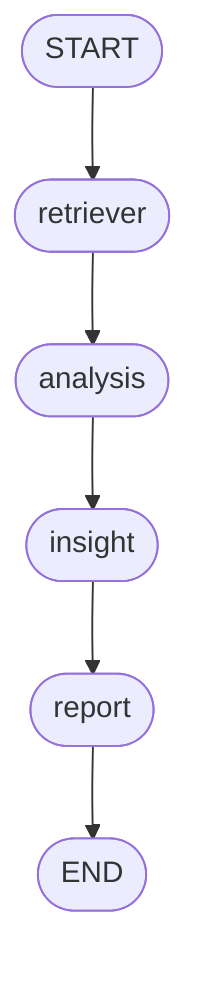

# Python Multi-Agent Deep Researcher POC

This is a minimal, structured POC demonstrating a multi-agent deep research workflow using LangGraph, LangChain, Streamlit, and the OpenRouter API.

## Architecture

The workflow is orchestrated using LangGraph:



*(Note: The Streamlit app also dynamically renders this diagram in the sidebar using `workflow.get_graph().draw_mermaid_png()` if dependencies support it.)*

## Technical Details (Step-by-Step)

1. **User Input & Document Upload (RAG)**
   - The user provides a research topic via the Streamlit chat interface.
   - (Optional) The user uploads PDF or TXT documents.
   - Using HuggingFace `all-MiniLM-L6-v2` embeddings, the documents are processed, chunked with `RecursiveCharacterTextSplitter`, and loaded into a local FAISS vector store index.

2. **Retriever Agent (Parallel Execution)**
   - Retrieves information from a variety of sources in parallel using `concurrent.futures`.
   - **Sources include:**
     - **Local RAG**: Queries the FAISS index for relevant uploaded context.
     - **Arxiv**: Searches scientific papers using the `arxiv` wrapper.
     - **Wikipedia**: Searches for encyclopedic context.
     - **DuckDuckGo**: Free dynamic web searching tool.
     - **Tavily / SerpAPI**: Performs web searches if API keys are provided.
   - **Fallback**: Leverages internal model domain knowledge if no external sources succeed or are provided.

3. **Analysis Agent**
   - Ingests the unified raw data from all retrieval tools.
   - Uses LangChain to synthesize the data, identify core themes, spot trends, and detect contradictory viewpoints across the sources.

4. **Insight Agent (Model Council)**
   - Acts as an AI Model Council to generate more robust, objective conclusions.
   - Prompts **two different foundation models** concurrently (e.g., OpenAI `gpt-4o-mini` and Anthropic `claude-4.5-sonnet`) with the same analysis and asks for their top forward-looking insights.
   - Uses the primary LLM as the "Council President" to synthesize the results, explicitly highlighting:
     - The **Consensus** (similar points between the models).
     - The **Divergence** (distinct, unique, or contradictory points).
     - A final synthesized set of profound insights.

5. **Report Agent (with Streaming)**
   - Drafts the final multi-section research report integrating findings, insights, and citations.
   - The LLM stream is captured using a custom `StreamlitCallbackHandler` tagged explicitly for this step, yielding a real-time type-writer effect constraint exclusively within the report step.

## Requirements
- Python 3.11+
- An [OpenRouter API Key](https://openrouter.ai/)

## Setup & Run

1. Navigate to this directory in your terminal:
   ```bash
   cd deep_researcher
   ```

2. Create a virtual environment (optional but recommended):
   ```bash
   python -m venv venv
   source venv/bin/activate  # On Windows use: venv\Scripts\activate
   ```

3. Install the dependencies:
   ```bash
   pip install -r requirements.txt
   ```

4. Run the Streamlit application:
   ```bash
   streamlit run app.py
   ```

Enjoy your deep research workflow!
