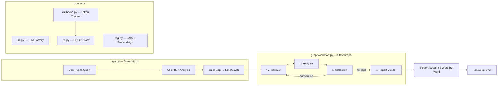
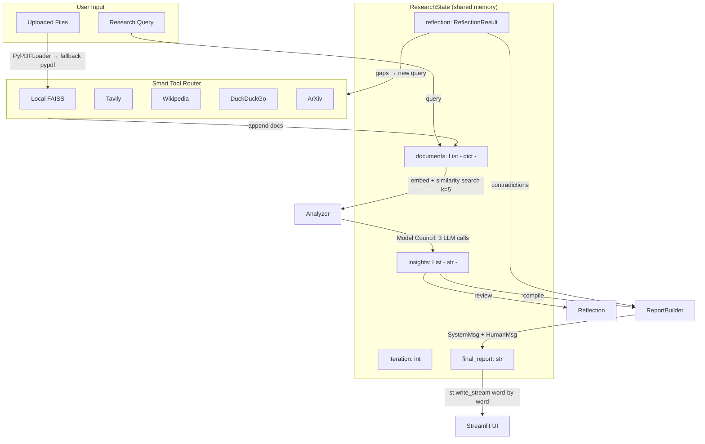

# 🔬 Multi-Agent Researcher — Complete Code Overview & Flow

## High-Level Architecture



---

## 📁 File-by-File Breakdown

### 1. Entry Point: [app.py](file:///Users/divyakiriti/Documents/workdir/Outskill/hackathon_Outskill/app.py)
**Role**: The entire Streamlit frontend — sidebar, research studio, live execution graph, follow-up chat, and stats dashboard.

**Key Sections**:

| Lines | What it does |
|---|---|
| L1-94 | Imports, page config, and **Custom CSS** (Inter font, glassmorphism, glowing agent widgets, pulse-border animations, dark theme) |
| L96-101 | `AGENT_INFO` dict — maps node names to icons/descriptions for the Live Execution Graph |
| L103-152 | `process_uploaded_files()` — takes uploaded PDFs/TXTs, splits them with `RecursiveCharacterTextSplitter`, indexes into FAISS. **Two-layer PDF parser**: `PyPDFLoader` primary, raw `pypdf.PdfReader` fallback for complex/LaTeX PDFs |
| L154-205 | **Sidebar** — AI Provider dropdown, Model Selection dropdown, API key inputs with ✅/❌ badges, maps `LLM_MODEL` env var |
| L207-209 | `load_app()` — direct call to `build_app()` (no cache, so agent code changes take effect immediately) |
| L211-223 | **Header** — "Multi-Agent Researcher by Group 12" gradient title |
| L225-226 | **Tabs** — "🔍 Research Studio" and "📊 Stats Dashboard" |
| L228-250 | **Research Input** — text area, "📎 Attach Documents" popover, "Run Analysis" button, initial state setup |
| L262-346 | **Live Execution Graph** — real-time agent widgets with arrows (↓), per-agent timing (⏱), loop-back indicators (🔄), source breakdown per retriever run |
| L356-375 | **Stats Logging** — logs tokens/cost/stage_breakdown to SQLite via `log_stats()` |
| L384-400 | **Report Streaming** — `st.write_stream()` renders the report word-by-word for a premium typing effect. On subsequent views, renders instantly via `st.markdown()` |
| L405-450 | **Follow-up Chat** — context-aware chat using the report + evidence as system prompt, each question tracked with its own `TokenTrackingCallback` |
| L452-516 | **Stats Dashboard** — aggregate metrics + expandable conversation history with nested Stage→Model cost breakdown |

---

### 2. Graph Orchestration: [graph/workflow.py](file:///Users/divyakiriti/Documents/workdir/Outskill/hackathon_Outskill/graph/workflow.py)
**Role**: Wires the 4 agents into a LangGraph `StateGraph` with conditional edges.

```python
def build_app():
    workflow = StateGraph(ResearchState)
    
    workflow.add_node("retriever", retriever_agent)
    workflow.add_node("analyzer", analyzer_agent)
    workflow.add_node("reflection", reflection_agent)
    workflow.add_node("report_builder", report_builder_agent)
    
    # Linear flow: START → Retriever → Analyzer → Reflection
    workflow.add_edge(START, "retriever")
    workflow.add_edge("retriever", "analyzer")
    workflow.add_edge("analyzer", "reflection")
    
    # Conditional: Reflection decides to loop or finish
    workflow.add_conditional_edges("reflection", should_continue, {
        "retriever": "retriever",        # Loop back
        "report_builder": "report_builder" # Done
    })
    
    workflow.add_edge("report_builder", END)
    return workflow.compile(checkpointer=SqliteSaver(conn))
```

**`should_continue()`** checks `reflection.needs_more_research` AND `iteration < MAX_ITERATIONS`. If both true → loop back to Retriever. Otherwise → Report Builder.

---

### 3. Shared State: [graph/state.py](file:///Users/divyakiriti/Documents/workdir/Outskill/hackathon_Outskill/graph/state.py)
**Role**: Defines the `TypedDict` that all agents read from and write to.

```python
class ResearchState(TypedDict):
    query: str                                    # The user's research question
    documents: Annotated[List[dict], add]          # Accumulated docs (auto-appended via reducer)
    insights: Annotated[List[str], add]            # Accumulated insights (auto-appended)
    reflection: Optional[ReflectionResult]         # Latest reflection output
    iteration: int                                 # Current loop count
    final_report: str                              # The finished report
```

> [!IMPORTANT]
> The `Annotated[..., add]` reducer is critical — it means that when an agent returns `{"documents": [new_docs]}`, LangGraph **appends** them to the existing list rather than overwriting. This is how insights from Iteration 1 and Iteration 2 are preserved in the final report.

---

### 4. The Agents

#### 🔍 [retriever_agent.py](file:///Users/divyakiriti/Documents/workdir/Outskill/hackathon_Outskill/agents/retriever_agent.py)
**Purpose**: Fetch data from the right sources using smart routing rules.

**Flow**:
1. If `iteration > 0` (reflection loop), uses `reflection.coverage_gaps[0]` as the search query
2. Asks the LLM which tools to use based on **5 explicit routing rules**:

| Query Category | Tools Selected | Example |
|---|---|---|
| **Document queries** | LOCAL RAG, TAVILY | "What does the document say about X?" |
| **Academic research** | ARXIV, WIKIPEDIA, TAVILY | "Transformer attention mechanisms" |
| **General knowledge** | WIKIPEDIA, TAVILY | "What is nuclear energy?" |
| **Current events / Industry** | TAVILY, DUCKDUCKGO | "Tesla stock performance 2024" |
| **Comprehensive research** | TAVILY, WIKIPEDIA, DDG, ARXIV | "Is nuclear energy net-positive?" |

3. **Auto-includes LOCAL RAG** if user has uploaded documents (FAISS index exists on disk)
4. Fires selected tools **in parallel** via `ThreadPoolExecutor(max_workers=5)`
5. Returns `{"documents": all_docs}` — the reducer appends these to existing documents

**Tools**:
| Tool | Source | What it fetches |
|---|---|---|
| `_run_faiss()` | Local FAISS | User-uploaded PDF/TXT documents |
| `_run_tavily()` | Tavily API | AI-powered web search, news, reports |
| `_run_arxiv()` | ArXiv API | Academic/scientific papers |
| `_run_wikipedia()` | Wikipedia API | General knowledge articles |
| `_run_ddg()` | DuckDuckGo | General web search fallback |

---

#### 🔬 [analyzer_agent.py](file:///Users/divyakiriti/Documents/workdir/Outskill/hackathon_Outskill/agents/analyzer_agent.py)
**Purpose**: RAG-grounded analysis + Model Council synthesis.

**Flow**:
1. Converts all accumulated document dicts → LangChain `Document` objects
2. Creates a **new FAISS index** from all documents and runs similarity search (`k=5`) against the query
3. Builds a prompt with the top-5 relevant evidence chunks
4. **Model Council** — 3 LLM calls:
   - **Member 1**: `get_fast_llm()` (selected model, temperature 0.1)
   - **Member 2**: Either `anthropic/claude-3-haiku` (Auto mode) or same model at temperature 0.7 (specific model mode)
   - **Council President**: Synthesizes both responses into "3-5 distinct insights"
5. Returns `{"insights": insights}` — appended via reducer

---

#### 🤔 [reflection_agent.py](file:///Users/divyakiriti/Documents/workdir/Outskill/hackathon_Outskill/agents/reflection_agent.py)
**Purpose**: Self-correction loop — detects gaps and decides whether to loop back.

**Flow**:
1. Uses `with_structured_output(ReflectionResult)` to get a Pydantic model back
2. The LLM evaluates the current insights against the original query and returns:
   - `coverage_gaps: List[str]` — what's missing
   - `contradictions: List[str]` — conflicting claims
   - `needs_more_research: bool` — should we loop?
3. Force-stops if `iteration + 1 >= MAX_ITERATIONS` (currently 2)
4. Returns `{"reflection": r, "iteration": iteration + 1}`

---

#### 📝 [report_agent.py](file:///Users/divyakiriti/Documents/workdir/Outskill/hackathon_Outskill/agents/report_agent.py)
**Purpose**: Compile everything into a critically-balanced, investigative research report.

**Key Design — Two-Message Architecture**:
- **SystemMessage**: Sets the "senior investigative analyst" persona. Explicitly penalizes promotional/one-sided output.
- **HumanMessage**: Provides all data (insights, raw evidence, sources) with strict section requirements.

**Mandatory Report Sections**:
| Section | What it covers |
|---|---|
| Executive Summary | Bottom-line answer + scope of evidence |
| Background & Context | Why this matters, landscape, trends |
| Key Findings | 5-8 findings with inline source citations |
| Strengths & Advantages | Evidence-backed positives |
| **Weaknesses, Risks & Limitations** | ≥3 points mandatory; downsides, gaps, red flags |
| **Grey Areas & Uncertainties** | ≥3 points mandatory; debatable claims, missing data |
| Comparative Analysis | Trade-offs vs alternatives |
| Contradictions & Open Questions | ≥2-3 open questions always required |
| Recommendations & Next Steps | Actionable advice with caveats |
| Sources | Full citation list |

**Critical Analysis Guardrails**:
- If evidence is one-sided → flags "⚠️ selection bias"
- If weaknesses aren't in evidence → infers them ("absence of X is itself a red flag")
- Minimum 1000 words target

---

### 5. Services Layer

#### [services/llm.py](file:///Users/divyakiriti/Documents/workdir/Outskill/hackathon_Outskill/services/llm.py) — Dynamic LLM Factory
- `_resolve_model()` — reads `LLM_MODEL` env var set by the sidebar dropdown
- `get_fast_llm()` — `ChatOpenAI` via OpenRouter, temperature **0.1** (tool selection, extraction)
- `get_reasoning_llm()` — temperature **0.4** (critical analysis, nuanced reasoning)
- `get_council_llm(model, temp)` — for the Analyzer's second council member
- All three always route through `OPENROUTER_BASE = "https://openrouter.ai/api/v1"`

#### [services/callbacks.py](file:///Users/divyakiriti/Documents/workdir/Outskill/hackathon_Outskill/services/callbacks.py) — Token & Cost Tracker
- `on_llm_start()` — captures `tags` (e.g., `["Analyzer"]`) and maps `run_id → stage_tag`
- `on_llm_end()` — reads `token_usage`, calculates cost, populates:
  - **`model_breakdown`**: flat `{ "openai/gpt-4o-mini": { tokens, cost } }`
  - **`stage_breakdown`**: nested `{ "Analyzer": { "openai/gpt-4o-mini": { tokens, cost } } }`

#### [services/db.py](file:///Users/divyakiriti/Documents/workdir/Outskill/hackathon_Outskill/services/db.py) — SQLite Stats Database
- `init_db()` — creates `query_stats` table with non-destructive `ALTER TABLE` migrations
- `log_stats()` — inserts a row with query, tokens, cost, `model_breakdown` JSON, `stage_breakdown` JSON
- `get_stats_history()` — returns a Pandas DataFrame for the dashboard
- `get_aggregate_stats()` — sums up lifetime totals

#### [services/rag.py](file:///Users/divyakiriti/Documents/workdir/Outskill/hackathon_Outskill/services/rag.py) — Shared Embeddings
- Initializes `HuggingFaceEmbeddings(model_name="all-MiniLM-L6-v2")` once
- `load_user_faiss()` — loads user-uploaded FAISS index from `temp_faiss_index/` if it exists

---

## 🔄 Complete Execution Flow

```
1. User types query → clicks "Run Analysis"
2. app.py: If files uploaded → process_uploaded_files()
   ├─ PyPDFLoader (primary) or pypdf.PdfReader (fallback for complex PDFs)
   └─ FAISS index saved to temp_faiss_index/

3. app.py: Instantiates TokenTrackingCallback, calls app.stream(initial_state, config)

4. ─── ITERATION 1 ───────────────────────────────────────────────────
   │
   ├─ 🔍 RETRIEVER
   │   ├─ LLM evaluates query against 5 routing rules → selects 2-4 tools
   │   ├─ Auto-includes LOCAL RAG if user docs exist on disk
   │   ├─ ThreadPoolExecutor fires selected tools in parallel
   │   ├─ Returns {"documents": [~15 chunks from selected sources]}
   │   └─ Live Graph shows: "Gathered 15 chunks → 3 from tavily · 5 from arxiv · ..."
   │
   │                              ↓
   │
   ├─ 🔬 ANALYZER
   │   ├─ Creates FAISS index from all docs → similarity search (k=5)
   │   ├─ Council Member 1 (selected model, temp 0.1)
   │   ├─ Council Member 2 (claude-3-haiku or same model at temp 0.7)
   │   ├─ Council President synthesis → 3-5 refined insights
   │   └─ Returns {"insights": [...]} — appended via reducer
   │
   │                              ↓
   │
   ├─ 🤔 REFLECTION
   │   ├─ Structured output: coverage_gaps, contradictions, needs_more_research
   │   ├─ Decides: gaps found → needs_more_research=True
   │   └─ Live Graph shows: "⚠️ 2 gap(s) detected: 'cost data' → Triggering re-retrieval"
   │
   │               🔄 Reflection Loop — re-querying for coverage gaps
   │
5. ─── ITERATION 2 ───────────────────────────────────────────────────
   │
   ├─ 🔍 RETRIEVER (uses coverage_gaps[0] as new query)
   ├─ 🔬 ANALYZER (FAISS now indexes ALL accumulated docs)
   ├─ 🤔 REFLECTION (iteration+1 >= MAX_ITERATIONS → force stop)
   │
   │                              ↓
   │
6. ─── FINAL ─────────────────────────────────────────────────────────
   │
   ├─ 📝 REPORT BUILDER
   │   ├─ SystemMessage: "Senior investigative analyst" persona
   │   ├─ Receives: insights + raw evidence chunks + source metadata
   │   ├─ Generates 1000+ word report with mandatory sections:
   │   │   Strengths, Weaknesses, Grey Areas, Comparative Analysis, etc.
   │   ├─ Inline citations: (Tavily: url), (ArXiv), (Wikipedia)
   │   └─ Returns {"final_report": "## Executive Summary\n..."}
   │
   └─ Pipeline complete!

7. app.py:
   ├─ Streams report word-by-word via st.write_stream
   ├─ Logs stats to SQLite: log_stats(query, tokens, cost, model_breakdown, stage_breakdown)
   └─ Enables Follow-up Chat (each question also tracked + logged)
```

---

## 📊 Data Flow Diagram



---

## 🔑 Key Design Decisions

| Decision | Why |
|---|---|
| **OpenRouter as single gateway** | One API key accesses GPT, Claude, and Gemini — no need for 3 separate provider SDKs |
| **`Annotated[List, add]` reducers** | Insights and documents accumulate across reflection loops instead of overwriting |
| **5-category tool routing rules** | LLM selects 2-4 tools based on query type instead of blasting all 5 tools every time |
| **Auto-include LOCAL RAG** | If FAISS index exists on disk (user uploaded docs), LOCAL RAG is always included regardless of LLM decision |
| **Two-layer PDF parser** | `PyPDFLoader` primary → raw `pypdf.PdfReader` fallback for complex/LaTeX PDFs |
| **FAISS created fresh each run** | Analyzer builds a new index from ALL accumulated docs (including loop 2), ensuring similarity search always covers everything |
| **`ThreadPoolExecutor`** | Retriever fires tools in parallel, reducing latency from ~15s sequential to ~4s |
| **Structured output for Reflection** | `with_structured_output(ReflectionResult)` returns Pydantic model — loop condition is deterministic |
| **Factory functions (`get_fast_llm()`)** | Created fresh each call so dropdown selection takes effect immediately |
| **No `@st.cache_resource`** | `load_app()` always builds fresh so agent code changes take effect without restarting Streamlit |
| **SystemMessage for Report Builder** | Forces "investigative analyst" persona; penalizes promotional/one-sided output |
| **Mandatory Weaknesses/Grey Areas** | Report must include ≥3 weaknesses and ≥3 grey areas — the LLM cannot skip these sections |
| **Tag-based cost tracking** | Each `.invoke()` passes `config={"tags": ["Analyzer"]}` for per-stage cost attribution |
| **Report streaming** | `st.write_stream` renders word-by-word for premium UX; on re-view renders instantly |
| **Reasoning temp 0.4** | Higher than default (0.2) for more critical, nuanced analysis instead of safe/agreeable output |
